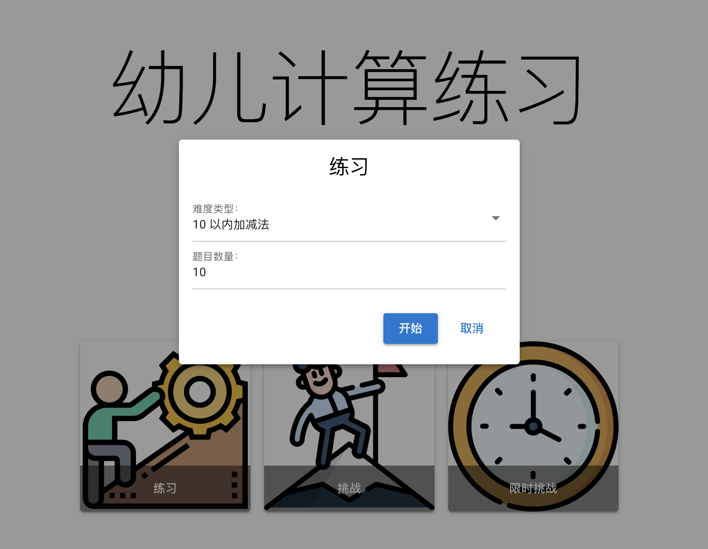
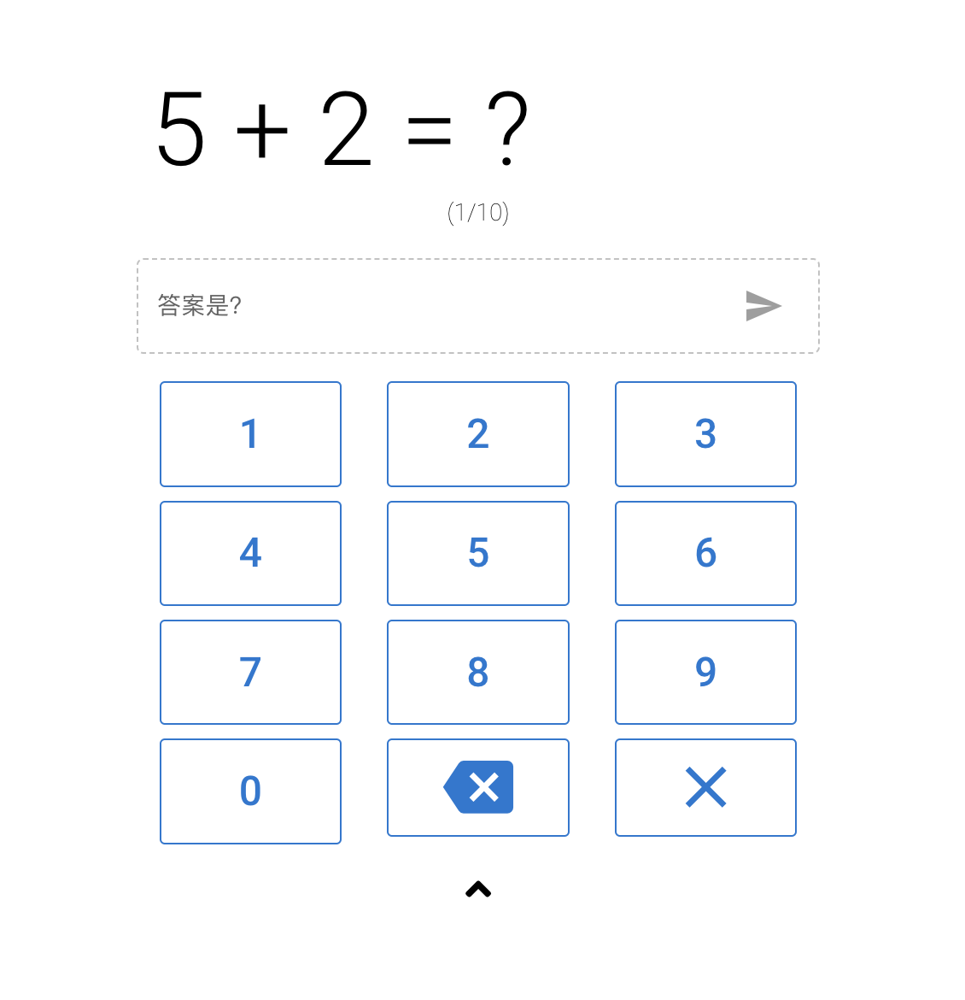
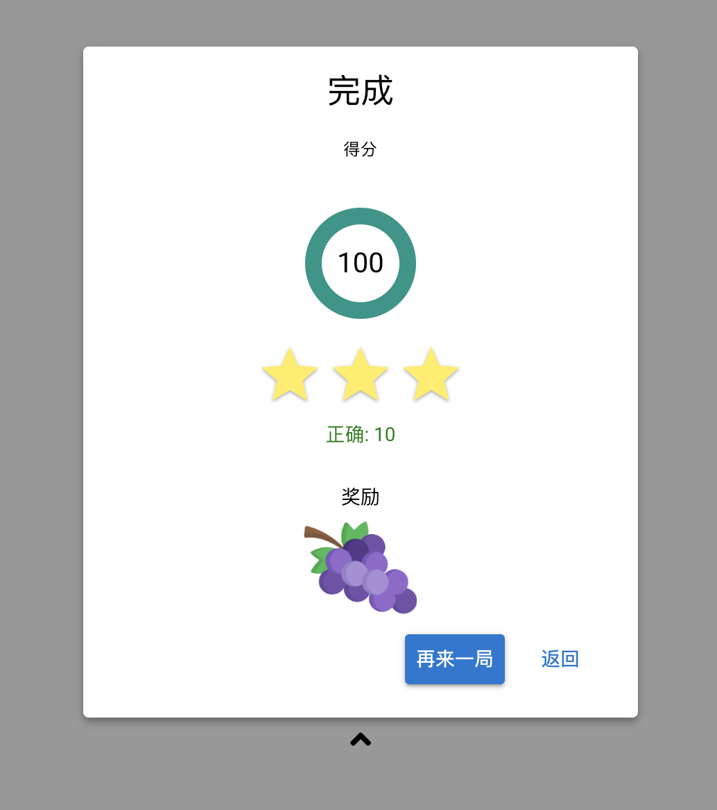

<p align="center">
   
   
   
</p>

# 有意思幼儿计算练习

## 简介

纯前端实现的幼儿计算练习，支持练习、挑战和限时挑战。

自适应电脑端和手机端，可自动出题，供幼儿计算练习。

[项目演示](http://jisuan.youyisi.online/)

截图：








## 开发

使用了 Vue2 以及 Quasar 框架，在 Node 14 上开发，其他版本未测试。

### 安装依赖

```bash
yarn
```

### 启动开发

```bash
yarn dev
```

### 构建

```bash
yarn build
```

### 格式化代码

```bash
yarn lint
```
